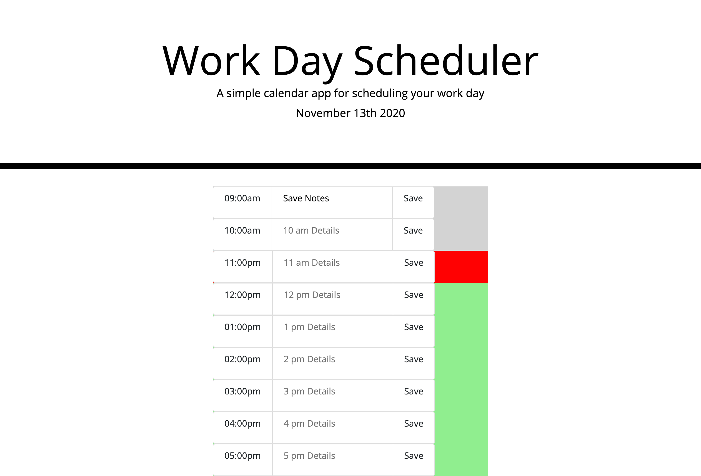

# Work Day Scheduler

-------------------------------------------------- Personal Notes -------------------------------------------------

Deployed GitHub Pages Link: https://eddiephi.github.io/Work-Day-Scheduler/

Description: I developed a Scheduling app using HTML, CSS Bootstrap and JavaScript Event Handling that stores work details to local storage and repopulates them when the page refreshes.

Screenshot:

Technologies: HTML5, CSS3, Bootstrap, JavaScript

License: MIT

I used https://validator.w3.org/nu/ to validate my work.

---------------------------------------------------- Contact ----------------------------------------------------

Email: ephimansone@gmail.com 

LinkedIn: https://linkedin.com/in/eddiephi

GitHub: https://github.com/EddiePhi

Portfolio: https://eddiephi.github.io/EddiePhiPortfolio/

