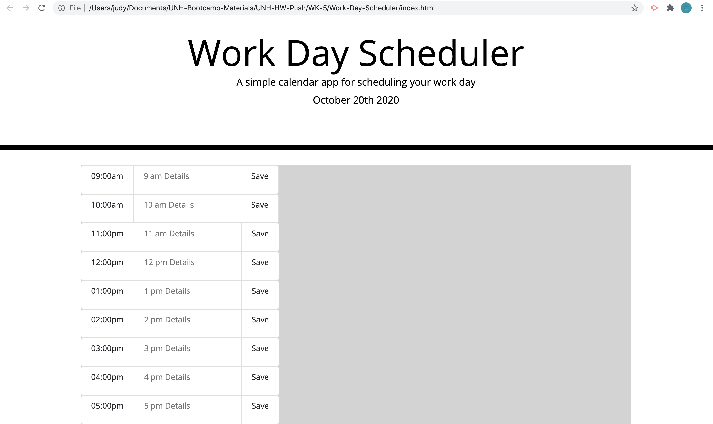

# Work Day Scheduler

---------------------------------------- Personal Notes ----------------------------------------

DEPLOYED GITHUB PAGES LINK: https://eddiephi.github.io/Work-Day-Scheduler/

DESCRIPTION: I developed a Scheduling app using HTML, CSS Bootstrap and JavaScript Event Handling that stores work details to local storage and repopulates them when the page refreshes.

SCREENSHOT:

I used https://validator.w3.org/nu/ to validate my site.

